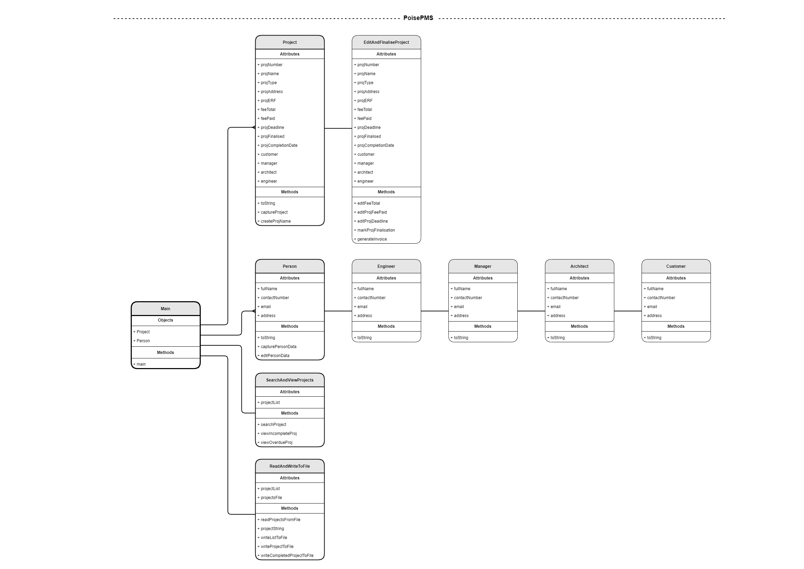
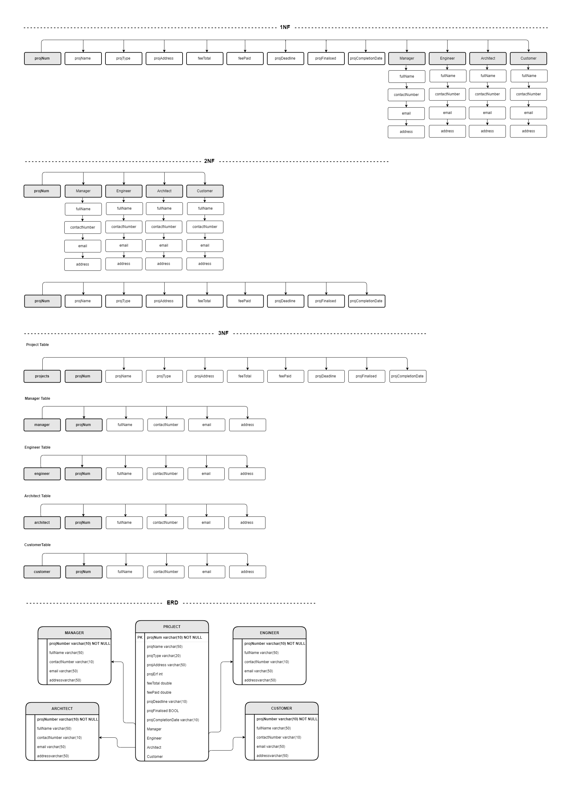

# Project Manager Ver. 4

A Java program that tracks various projects and project members.

## Description

This program is for a fictitious structural engineering firm, called Poised, that allows them to capture project information, search for and edit project information, as well as update the personal details of the persons involved in the project.

This is the forth version of the Project Manager program ([Ver 1](https://github.com/MeganBisschoff/Project_Manager), [Ver 2](https://github.com/MeganBisschoff/Project_Manager_Ver_2), [Ver 3](https://github.com/MeganBisschoff/Project_Manager_Ver_3)) which now connects, reads from and executes queries to a database through a Java API, instead of a local file.

**Updates:**

* As the program now works with a SQL database, the ``ReadAndWriteToFile()`` class from version 3 has been modified to ``ReadAndWriteToDatabase()``.
* The program expands on the people involved in a project (instantiated as Persons's) which now includes an ``Engineer()``, ``Manager()``, ``Architect()`` and ``Customer()`` but excludes the Contractor.
* The ``Person()`` class now includes methods to update the Engineer, Manager, Architect and Customer in not only a list but in the ``PoisePMS_db`` database too.

## Program Overview

The three primary functions of the program are to:

1. Create ``Project`` objects which contains all the project infomration.
2. Create ``Person`` objects for each project, such as an ``Architect``, ``Manager``, ``Engineer`` and ``Customer``, which contains their contact details.
3. Access project data to perform various editing operations on the objects.

The program includes the following classes, subclasses and methods:

* **``Main()``**
* **``Project()``**
	* ``toString()``
  	* ``captureProject()``
  	* ``createProjectName()``
* **``EditAndFinaliseProject()``** extends ``Project()``
  	* ``editAndUpdateProjFeeTotal()``
  	* ``editAndUpdateProjFeePaid()``
  	* ``editAndUpdateProjDeadline()``
  	* ``markProjFinalisation()``
	* ``generateInvoice()``
* **``SearchAndViewProjects()``**
	* ``searchProj()``
  	* ``viewAllProj()``
  	* ``viewIncompleteProj()``
  	* v``iewOverdueProj()``
* **``Person()``**
	* ``toString()``
  	* ``capturePersonData()``
  	* ``editPersonData()``
  	* ``updateManagerInDB()``
	* ``updateEngineerInDB()``
  	* ``updateArchitectInDB()``
  	* ``updateCustomerInDB()``
* **``Manager()``** extends ``Person()``
  	* ``toString()``
* **``Engineer()``** extends ``Person()``
  	* ``toString()``
* **``Architect()``** extends ``Person()``
  	* ``toString()``
* **``Customer()``** extends ``Person()``
  	* ``toString()``
* **``ReadAndWriteToDatabase()``**
  	* ``readProjectsFromDatabase()``
  	* ``writeProjectToDatabase()``
* **``Package()``**

An project object instantiated in the ``Project()`` class includes the object attributes, along with getters and setters for:

* projNumber
* projName
* projType
* projAddress
* projErf
* feeTotal
* feePaid
* projDeadline
* projFinalised
* projCompletionDate
* projectCaptured
* customer
* architect
* manager
* engineer

A new ``Architect()``, ``Manager()``, ``Engineer()`` and ``Customer()`` object is instantiated in their respective subclasses which extends the ``Person()`` class.

A person object instantiated in the ``Person()`` class includes the object attributes, along with getters and setters for:

* fullName
* contactNumber
* email
* address

The ``Package()`` class contains a brief overveiw of the program.

## The Project Manager Program

At startup, a list of Project attribute information is read from the ``PoisePMS_db`` database and populated into new Project objects. The project objects are added to a global ``projectList`` for further operation as selected by the user from the Poised program menu.

Once the program is running, the main ``programMenu`` is presented to the user:

```java
String programMenu = "\n--- Poised Program Menu ---\n" 
	+ "\nEnter 1 to capture a new Poise project"
	+ "\nEnter 2 to search and view projects"
	+ "\nEnter 3 to edit and finalise a project"
	+ "\nEnter 4 to edit the contractors, architects and customers details"
	+ "\nEnter 5 to update file and exit the program"
	+ "\nEnter selection: ";
```

**_If user selects ``1``:_**

A new project object is captured in the ``Project()`` class, and the customer, architect and contractor objects are captured in the ``Person()`` class. After a project is captured, the details are added to the project list as well as updated in the ``PoisePMS_db`` database.

The ``Project()`` class includes the methods:

* toString()
* captureProject()
* createProjectName()

The ``Person()`` class includes the methods:

* toString()
* capturePersonData()
* editPersonData()
* updateEngineerInDB()
* updateEngineerInDB()
* updateArchitectInDB()
* updateCustomerInDB()

**_If user selects ``2``:_**

The following ``searchAndViewMenu`` submenu is presented to the user.

```java
String searchAndViewMenu = "\n--- Search and View Projects ---\n"
	+ "\nEnter 1 to search for a project"
	+ "\nEnter 2 to view all projects"
	+ "\nEnter 3 to view incomplete projects"
	+ "\nEnter 4 to view overdue projects"
	+ "\nEnter your selection: ";
```
The ``SearchAndViewProjects()`` class returns the information of the project the user wishes to view from the list.

The above menu operations are carried out in the ``SearchAndViewProjects()`` class which includes the methods to:

* searchProj()
* viewAllProj()
* viewIncompleteProj()
* viewOverdueProj()

**_If user selects ``3``:_**

The following ``editAndFinaliseMenu`` submenu is presented to the user.

```java
String editAndFinaliseMenu = "\n--- Edit Project Details ---\n"
	+ "\nEnter 1 to edit the projects total fee"
	+ "\nEnter 2 to edit the projects fee paid"
	+ "\nEnter 3 to edit the projects deadline"
	+ "\nEnter 4 to finalise the project"
	+ "\nEnter your selection: ";
```

The ``SearchAndViewProjects()`` class returns the information of the project the user wishes to edit from the list.

The menu operations are carried out in the ``EditAndFinaliseProject()`` class which includes methods to:

* editProjFeeTotal()
* editProjFeePaid()
* editProjDeadline()
* markProjFinalisation()
* generateInvoice()

**_If user selects ``4``:_**

The ``editPersonData()`` method in the ``Person()`` class is called to ``get()`` and ``set()`` the attributes of the Architect, Contractor or Customer, which is then updated in the list.

**_If user selects ``5``:_**

The ``ReadAndWriteToFile()`` class is called which writes the updated projects in the list to file before exiting the Program.

The ``ReadAndWriteToFile()`` class also includes functions to:

* readProjectsFromFile()
* projectString()
* writeListToFile()
* writeProjectToFile()
* writeCompletedProjectToFile()

## Functionality summary

* Capture information about new projects.
* Edit the projects deadline, fee total and fee paid.
* Finalise a project and add a completion date.
* See a list of projects that still need to be completed.
* See a list of projects that are past the due date.
* Search for a project by project number or project name.
* Update the manager's, engineer's, architect's and customer's information.

## Programming principles

This program employs the programming concepts of JDBC database programming and Java OOP including classes, get and set methods, dot notation, functions and establishing SQL connections to execute queries. Furthermore it employs fundamental programming techniques that include switch block handling, lists, comparison operators, conditional logic, loops, indexing, date formatting and string handling.

## Dependencies

* Java Database Connectivity MySQL API is used to communicate with the DB server.
* import java.sql.*;
* import java.util.List;
* import java.util.Locale;
* import java.util.Scanner;
* import java.util.LocalDate;
* import java.time.format.DateTimeFormatter;

## Running the program

Open all the files in the poised package in any Java IDE and run the Main.java file.

## Java class diagram



## SQL dependency diagram



## Code preview

```java
/* Method gets Project and Person values of the given project object and inserts the data into 
* their respective <code>project</code>, <code>manager</code>, <code>engineer</code>, 
* <code>architect</code> and <code>customer</code> tables.
* 
* @param poiseProject 	a newly created project object.
* @throws SQLException 
*/
public static void writeProjectToDatabase (Project poiseProject) throws SQLException {
	
	try {
		// Initiliase connection to the PoisePMS database and statement to execute queries.
		Connection connection = DriverManager.getConnection(
				"jdbc:mysql://localhost:3306/PoisePMS_db?useSSL=false",
				"otheruser",
				"swordfish");
		
		Statement projectStatement = connection.createStatement();
		Statement managerStatement = connection.createStatement();
		Statement engineerStatement = connection.createStatement();
		Statement architectStatement = connection.createStatement();
		Statement customerstatement = connection.createStatement();
		
		// Initialise and get the projects values.
		String projNumber = poiseProject.getProjNumber();
		String projName = poiseProject.getProjName();
		String projType = poiseProject.getProjType();
		String projAddress = poiseProject.getProjAddress();
		int projErf = poiseProject.getProjErf();
		double feeTotal = poiseProject.getFeeTotal();
		double feePaid = poiseProject.getFeePaid();
		LocalDate projDeadline = poiseProject.getProjDeadline();
		boolean projFinalised = poiseProject.getProjFinalised();
		// Completion date set to null, as there is a specific method for updating field.
		LocalDate projCompletionDate = null;
		
		// Get managers values.
		String mangFullName = poiseProject.getManager().getFullName();
		String mangContactNumber = poiseProject.getManager().getContactNumber();
		String mangEmail = poiseProject.getManager().getEmail();
		String mangAddress = poiseProject.getManager().getAddress();
		
		// Get engineers values.
		String engFullName = poiseProject.getEngineer().getFullName();
		String engContactNumber = poiseProject.getEngineer().getContactNumber();
		String engEmail = poiseProject.getEngineer().getEmail();
		String engAddress = poiseProject.getEngineer().getAddress();
		
		// Get architects values.
		String archFullName = poiseProject.getArchitect().getFullName();
		String archContactNumber = poiseProject.getArchitect().getContactNumber();
		String archEmail = poiseProject.getArchitect().getEmail();
		String archAddress = poiseProject.getArchitect().getAddress();
		
		// Get customers values.
		String custFullName = poiseProject.getCustomer().getFullName();
		String custContactNumber = poiseProject.getCustomer().getContactNumber();
		String custEmail = poiseProject.getCustomer().getEmail();
		String custAddress = poiseProject.getCustomer().getAddress();
		
		// Update the project values.
		projectStatement.executeUpdate(
				"INSERT INTO projects VALUES ("
						+ "'" + projNumber + "', "
						+ "'" + projName + "', "
						+ "'" + projType + "', "
						+ "'" + projAddress + "', "
						+ projErf + ", "
						+ feeTotal + ", "
						+ feePaid + ", "
						+ "'" + projDeadline + "', " 
						+ projFinalised + ", "	
						+ projCompletionDate + ");");
		
		// Update the managers values.
		managerStatement.executeUpdate(
				"INSERT INTO manager VALUES (" 
						+ "'" + projNumber + "', "
						+ "'" + mangFullName + "', "
						+ "'" + mangContactNumber + "', "
						+ "'" + mangEmail + "', "
						+ "'" + mangAddress + "'" + ");"); 
		
		// Update the engineers values.
		engineerStatement.executeUpdate(
				"INSERT INTO engineer VALUES (" 
						+ "'" + projNumber + "', "
						+ "'" + engFullName + "', "
						+ "'" + engContactNumber + "', "
						+ "'" + engEmail + "', "
						+ "'" + engAddress + "'" + ");");
		
		// Update the architects values.
		architectStatement.executeUpdate(
				"INSERT INTO architect VALUES (" 
						+ "'" + projNumber + "', "
						+ "'" + archFullName + "', "
						+ "'" + archContactNumber + "', "
						+ "'" + archEmail + "', "
						+ "'" + archAddress + "'" + ");");
		
		// Update the customers values.
		customerstatement.executeUpdate(
				"INSERT INTO customer VALUES (" 
						+ "'" + projNumber + "', "
						+ "'" + custFullName + "', "
						+ "'" + custContactNumber + "', "
						+ "'" + custEmail + "', "
						+ "'" + custAddress + "'" + ");");
		
		// Close connection and objects.
		connection.close();
		projectStatement.close();
		projectStatement.close();
		engineerStatement.close();
		architectStatement.close();
		customerstatement.close();
	}
	catch (SQLException e) {
		e.printStackTrace();
	}
}
```

## Program output preview

```
--- Project Information ---

Project Number:     111
Project Name:       Ocean View
Building Type:      House
Physical address:   11 Ocean drive, Cape Town
ERF Number:         10111
Total fee.:         R 2000000.0
Total paid:         R 200000.0
Deadline:           2022-01-01
Finalised:          True
Completed date:     2022-06-01

--- Manager ---
Name:               Mary Mang
Telephone number:   0123456789
Email address:      mary@mail.com
Physical address:   11 Main street, Cape Town

--- Engineer ---
Name:               Esme Engine
Telephone number:   0123456789
Email address:      esme@mail.com
Physical address:   11 Industrial drive, Cape Town

--- Architect ---
Name:               Alistair Archi
Telephone number:   0123456789
Email address:      alistair@mail.com
Physical address:   11 Office road, Cape Town

--- Customer ---
Name:               Catherine Cust
Telephone number:   0123456789
Email address:      catherine@mail.com
Physical address:   11 Beach avenue, Cape Town
```

&nbsp;
***  
_A project is complete when it starts working for you, rather than you working for it._ ~ Scott Allen
***
&nbsp;

## Author

**Megan Bisschoff** 2022

*Project submitted for Software Engineering learnership Level 3 Task 08 at [HyperionDev](https://www.hyperiondev.com/)*

*[View](https://www.hyperiondev.com/portfolio/86596/) submission results.*
